<h1 align='center'>
<u>KAGGLE CREDIT CARD FRAUD DETECTION</u>
</h1>


## Declaration

> **Author**: This project was independently conceived, developed, and completed by Ngundo Muithya. All code, analysis, and documentation herein represent my own original work.

## Overview

Credit card fraud is a significant and growing threat to the financial industry, both globally and in Kenya. According to the [Central Bank of Kenya's Financial Sector Stability Report](https://businessfront.com/finance/insights/fraud-costs-hit-11m-kenyan-banks/), card fraud losses at Kenyan banks surged more than 16-fold in a single year, from **KSh 15.5 million** to **KSh 263.3 million**, even as the number of reported incidents rose only marginally. This shows that individual fraud cases are becoming far more costly, not just more frequent, underscoring the need for effective detection systems.

Fraudulent transactions also represent a small fraction of all transactions, resulting in highly imbalanced datasets that make detection a challenging machine learning problem. This project builds a classification pipeline to detect fraudulent credit card transactions, addressing this imbalance through techniques such as SMOTE and tuned ensemble models.

The dataset used ([here](./Data/creditcard.csv)) comes from [Kaggle](https://www.kaggle.com/datasets/mlg-ulb/creditcardfraud) and contains transactions made by European cardholders in Spetember 2013.

Five model families were evaluated:

a) **Logistic Regression**

b) **XGBoost**

c) **Random Forest**

d) **Decision Tree**

e) **Neural Network**

to find the best model for the problem. Class imbalance is handled throughout the modelling approach.

## Instructions to clone

Ensure, after cloning the repository, to run the following command in the terminal while in the project folder:

```bash
git lfs pull
```

This downloads the credit card data into your local machine.

## Instructions to load the best model

The best model is saved as a `sklearn` pipeline using `cloudpickle`. To load it, simply run this code:

```python
import cloudpickle as cp

with open('./best_overall_model.pkl', 'rb') as f:
    best_overall_model = cp.load(f)

print("Model loaded successfully")
```

<h2 id='table-of-contents' align='center'>
1. Table of Contents
</h2>

1. [Data Understanding](#data-understanding)

2. [Data Visualization](#data-visualization)

3. [Model Building](#model-building)

   a) [Logistic Regression](#logistic-regression)

   b) [XGBoost](#xgboost)

   c) [Random Forest](#random-forest)

   d) [Decision Tree](#decision-tree)

   e) [Neural Network](#neural-network)

4. [Model Evaluation](#model-evaluation)

5. [Conclusions](#conclusions)

<h2 id='data-understanding' align='center'>
2. Data Understanding
</h2>

The dataset used ([here](./Data/creditcard.csv)) comes from [Kaggle](https://www.kaggle.com/datasets/mlg-ulb/creditcardfraud) and contains transactions made by European cardholders in Spetember 2013.

The dataset is highly imbalanced with the positive class (frauds) accounting for only **0.172%** of the transactions.

Features **V1, V2,..., V28** are the principal components obtained with PCA. The only features which have not been transformed with PCA are **Time** and **Amount**.

**Time** contains the **seconds** elapsed between each transaction and the first transaction in the dataset.

**Amount** is the transaction amount, this feature can be used for example-dependant cost-sensitive learning. (The currency was not provided by Kaggle)

**Class** is the response variable and it takes value 1 in case of fraud and 0 otherwise.

<h2 id='data-visualization' align='center'>
3. Data Visualisation
</h2>

### a) Class Imbalance

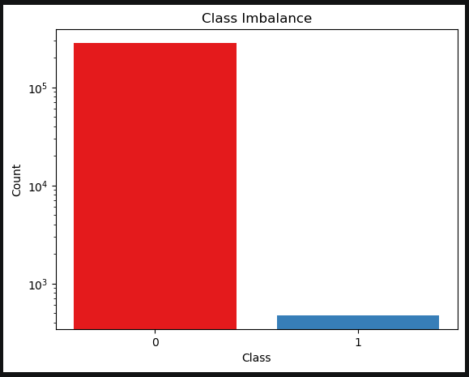

Using a logarithmic scale for the y-axis makes the sheer class imbalance the dataset suffers from clear, with the negative class(0) making up **~99%** of the dataset.

### b) Amount Distribution

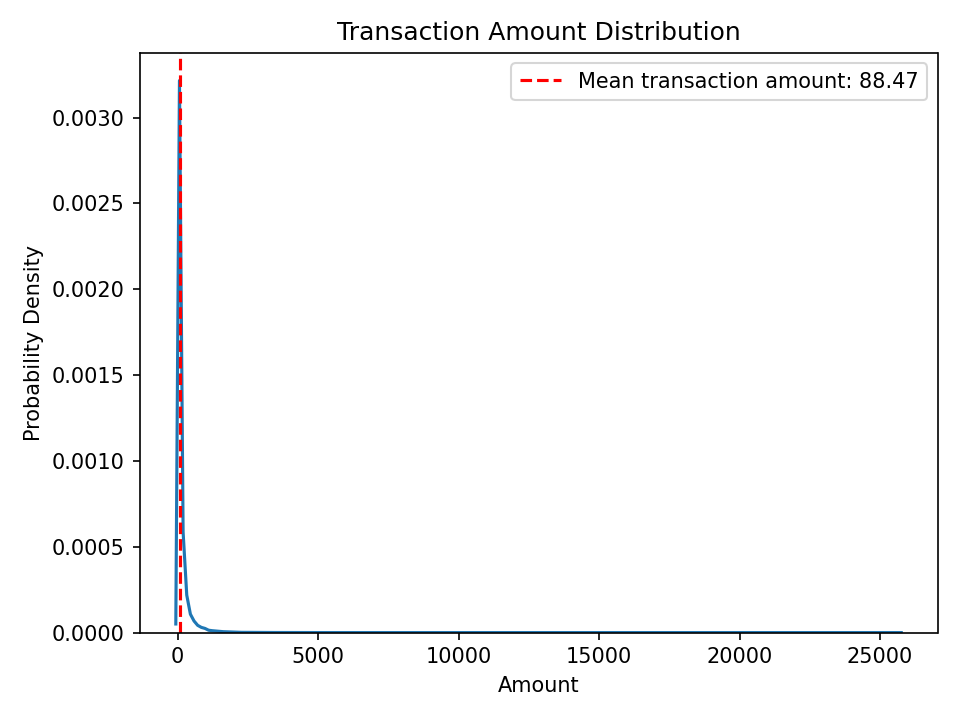

Most of the transaction amounts tend to cluster around the mean of **88** with higher amounts, such as 25,000 being very rare.

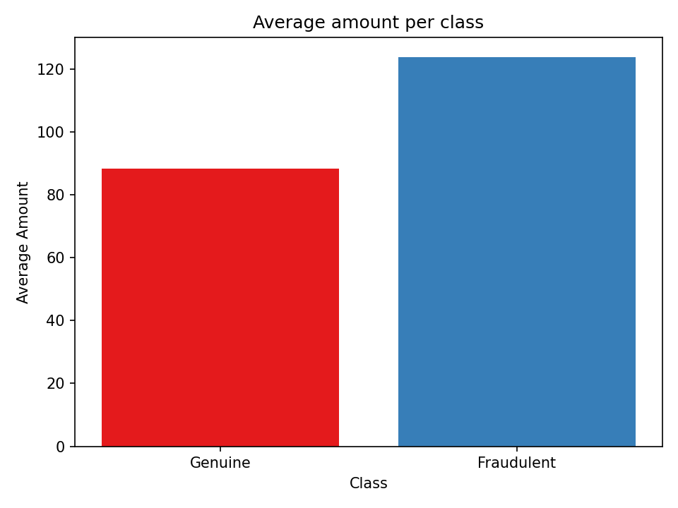

On average, fraudulent transactions tend to be of higher amounts than genuine ones. This is to be expected, as the requests from criminals will almost always be for large sums of money.

### c) Time Distribution

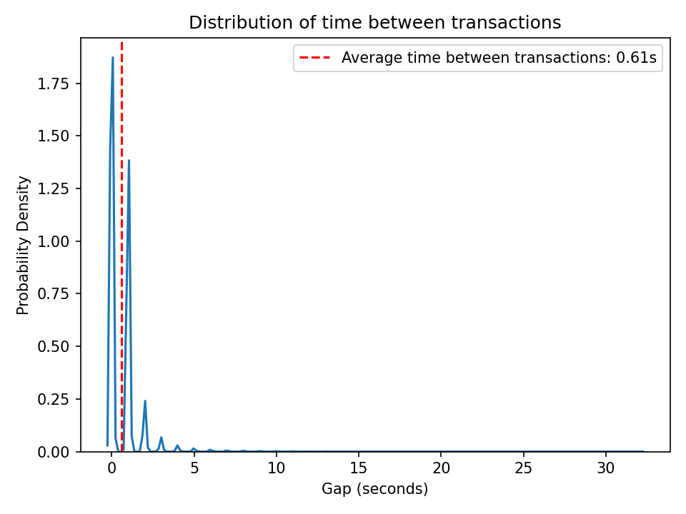

This plot shows peaks at whole number values for the gap between transactions. This is because the time values provided in the dataset were all integers, so their gaps would also be integers, and the probability of finding decimal gaps is effectively 0.

The most frequent gap was **0 seconds**.

> **NB**: This is not to mean that the transactions occurred at the same time. It is not possible for any system to handle two transactions at exactly the same time. It just suggests that the level of granularity chosen to record the time (seconds) was not enough to show a clear separation between transactions. If the transaction times were recorded in milliseconds, for example, they might show that the transactions occurred at different times.

Larger gaps become less and less frequent. Those larger gaps indicate periods when transaction traffic was low. This could be for any number of reasons e.g. it could have been at night when people were asleep or the system(s) experienced some form of downtime.

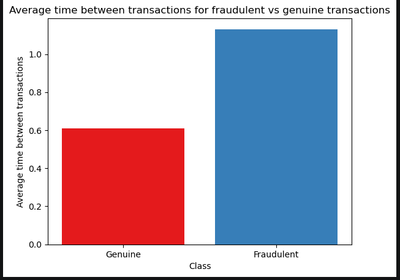

Fraudulent transactions tend to occur when transactions are happening **infrequently** i.e. the gap between transactions is high compared to genuine transactions. This could be due to any number of reasons.

<h2 id='model-building' align='center'>
4. Model Building
</h2>

_Click [here](#table-of-contents) to go back to the table of contents._

Five model families were built:

a) **Logistic Regression** - This will be our baseline model. We will compare all the other models to this baseline.

b) **XGBoost** - This tree ensemble might prove effective at predicting.

c) **Random Forest** - Another tree ensemble

d) **Decision Tree** - A single decision tree

e) **Neural Network** - A collection of artificial neurons connected by weighted edges

**Recall** was prioritised as false negatives (missed events) are costly and should be minimized.

Two strategies were employed to deal with the class imbalance present in the dataset: **SMOTE** and **Using balanced class weight** with the best model using either of the two strategies being selected for the final evaluation across the model families.

Here are the results:

<h3 id='logistic-regression' align='center'>
a) Logistic Regression
</h3>

_Click [here](#table-of-contents) to go back to the table of contents._

#### i) Unbalanced

|              | precision |   recall | f1-score | support |
| :----------- | --------: | -------: | -------: | ------: |
| 0            |  0.999623 | 0.999635 | 0.999629 |   84976 |
| 1            |  0.780142 | 0.774648 | 0.777385 |     142 |
| accuracy     |   0.99926 |  0.99926 |  0.99926 | 0.99926 |
| macro avg    |  0.889883 | 0.887142 | 0.888507 |   85118 |
| weighted avg |  0.999257 |  0.99926 | 0.999259 |   85118 |

#### ii) Balanced

|              | precision |   recall |  f1-score |  support |
| :----------- | --------: | -------: | --------: | -------: |
| 0            |  0.999945 | 0.858607 |  0.923902 |    84976 |
| 1            | 0.0113552 | 0.971831 | 0.0224481 |      142 |
| accuracy     |  0.858796 | 0.858796 |  0.858796 | 0.858796 |
| macro avg    |   0.50565 | 0.915219 |  0.473175 |    85118 |
| weighted avg |  0.998296 | 0.858796 |  0.922398 |    85118 |

#### iii) SMOTE

|              | precision |   recall |  f1-score | support |
| :----------- | --------: | -------: | --------: | ------: |
| 0            |  0.999897 | 0.912458 |  0.954178 |   84976 |
| 1            | 0.0176944 | 0.943662 | 0.0347375 |     142 |
| accuracy     |   0.91251 |  0.91251 |   0.91251 | 0.91251 |
| macro avg    |  0.508796 |  0.92806 |  0.494458 |   85118 |
| weighted avg |  0.998258 |  0.91251 |  0.952644 |   85118 |

#### iv) Evaluation

All of the models are very good at predicting genuine transactions, with extremely high precision, recall and f1-scores on the negative class (0). The unbalanced model is the best at predicting the negative class.

However, the balanced and SMOTE models show poor precision scores on the positive class (which contributes to their poor f1-score as well) despite having very high recall on the same class. As stated earlier, this is a sign that the models have a high number of **false positives**. In the context of our application, this means the models flag a high number of genuine transactions as fraudulent (false alarms).

The models having a higher recall, however, than the unbalanced model means they capture more of the fraudulent events at the expense of more false alarms.

This is something we are willing to tolerate as a false alarm is less costly compared to a missed event.

Let us look at the confusion matrices for the models to get a clearer picture of their performances.

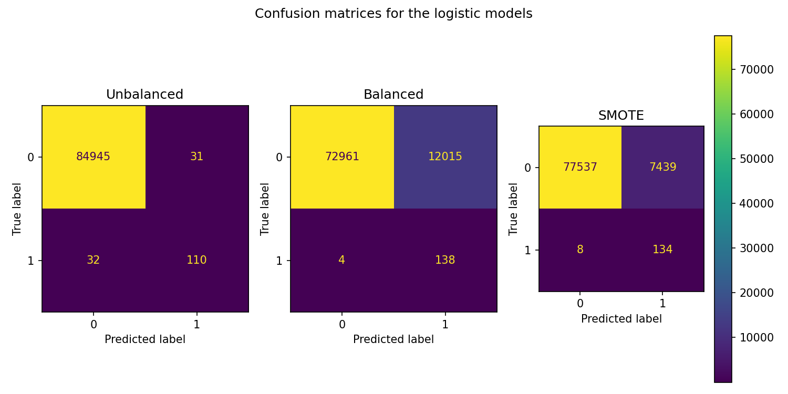

The unbalanced logistic model has a higher number of **false negatives** (missed events) compared to the SMOTE and balanced models. This is the metric we care about! A good model should be able to detect as many of the positive events as possible; that means have as **few false negatives** as possible. The unbalanced logistic model, therefore, **cannot** be the best logistic model.

The balanced model had more false positives (false alarms) compared to the SMOTE model while having a higher number of true positives and less false negatives. The balanced model captures (slightly) more of the fraudulent events but at the cost of (significantly) more false alarms. As stated earlier, this is something we are willing to tolerate as false alarms are less costly compared to missed events.

Ideally, of course, we would like to have a model that captures the **highest number of fraudulent events** with as **few false alarms** as possible. If this is not possible, however, we will go with the model that captures the most fraudulent events.

Let us take a look at the **PR-AUC** curves for the models on both the train and test sets. These will help us assess which of the models captures the highest number fraudulent events with as few false alarms (false positives) as possible.

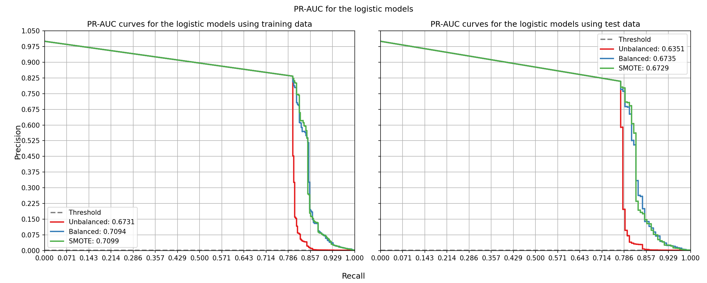

The PR-AUC curves tell us something interesting:

- all the models have curves that are significantly far away from the horizontal threshold (the grey dashed line near the bottom). Curves that dance around that line indicate models that are simply predicting positives according to the probability distribution of the positive class in the training data: a naive (underfitted) model.

- the performance of the model's drops slightly from when using the training data and when using the testing data. This is an indication that the models might be slightly overfitted.

- the model with the highest average precision score across different decision thresholds is the **balanced** model. This means that, across different decision thresholds, the balanced model raises the fewest false alarms

The **balanced** model has the highest **average precision score** on the test set of **0.6735**. This, combined with its high recall, make it the **best** model for our purposes since this means that it captures the **highest number of events** with the **fewest false alarms** of the 3 models evaluated.

#### v) Conclusion

The **balanced logistic model** is the **best logistic model** and it is the model we shall use as our baseline moving forward.

<h3 id='xgboost' align='center'>
b) XGBoost
</h3>

_Click [here](#table-of-contents) to go back to the table of contents._

#### i) Unbalanced

|              | precision |   recall | f1-score |  support |
| :----------- | --------: | -------: | -------: | -------: |
| 0            |  0.999588 | 0.999929 | 0.999759 |    84976 |
| 1            |  0.946903 | 0.753521 | 0.839216 |      142 |
| accuracy     |  0.999518 | 0.999518 | 0.999518 | 0.999518 |
| macro avg    |  0.973245 | 0.876725 | 0.919487 |    85118 |
| weighted avg |    0.9995 | 0.999518 | 0.999491 |    85118 |

#### ii) Balanced

|              | precision |   recall | f1-score |  support |
| :----------- | --------: | -------: | -------: | -------: |
| 0            |  0.999821 | 0.985867 | 0.992795 |    84976 |
| 1            | 0.0956325 | 0.894366 | 0.172789 |      142 |
| accuracy     |  0.985714 | 0.985714 | 0.985714 | 0.985714 |
| macro avg    |  0.547727 | 0.940116 | 0.582792 |    85118 |
| weighted avg |  0.998313 | 0.985714 | 0.991427 |    85118 |

#### iii) SMOTE

|              | precision |   recall | f1-score |  support |
| :----------- | --------: | -------: | -------: | -------: |
| 0            |  0.999809 |  0.98589 | 0.992801 |    84976 |
| 1            | 0.0950943 | 0.887324 | 0.171779 |      142 |
| accuracy     |  0.985726 | 0.985726 | 0.985726 | 0.985726 |
| macro avg    |  0.547452 | 0.936607 |  0.58229 |    85118 |
| weighted avg |    0.9983 | 0.985726 | 0.991431 |    85118 |

#### iv) Evaluation

All the models perform well on the negative class with the unbalanced model performing the best.

The unbalanced model has high precision (**0.9469**) but relatively low recall (**0.7535**) on the positive class. This means that it has a low number of false positives (false alarms). It, however, has a relatively high number of false negatives (missed events) as evidenced by its relatively low recall on the positive class. This makes it a bad candidate for the best overall model.

The balanced model has a higher precision than the SMOTE model (**0.0956**) and a slightly higher recall (**0.8944**) on the positive class. This means it has a lower number of false negatives as the SMOTE model and fewer false alarms (or more true positives). This is the best case scenario for the model we want. This makes the **balanced model** the best of the three.

The SMOTE model has a very low precision score (**0.0951**) but a high recall (**0.8873**) on the positive class. This means it has a higher number of false positives but a lower number of false negatives. This makes it a better model for our purposes.

Let us take a look at their confusion matrices.

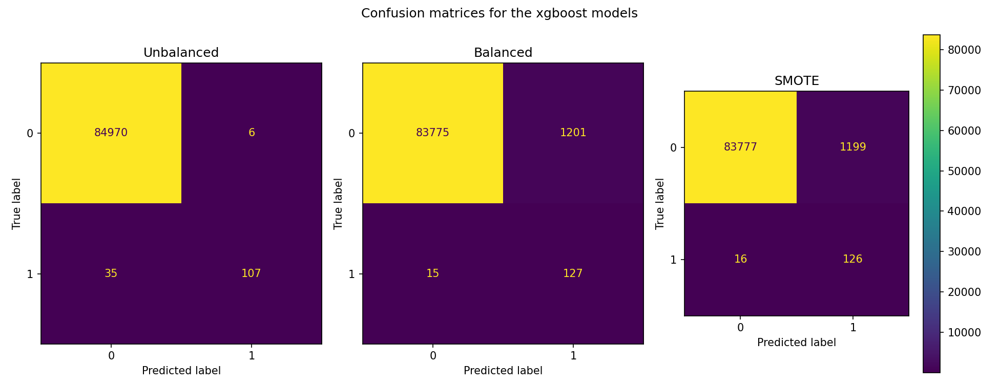

We can see that, as said earlier, the unbalanced model has a low number of false positives but a (relatively) high number of false negatives. Since missed events (false negatives) are more costly than false alarms, the unbalanced model is **NOT** the model to go with.

As we saw earlier, the balanced model has a (slightly) lower number of false negatives as the SMOTE model (**15** vs **16**) with more true positives (**127** vs **126**). It offers a slightly better capability of catching fraudulent events compared to the SMOTE model with a minimal increase in false alarms.

Let us take a look at the **PR-AUC** curves for the models.

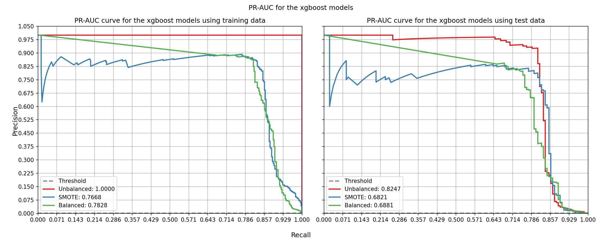

Looking at the **PR-AUC curves**:

- the unbalanced model performs the best across the board. It has the highest PR-AUC score on both the train and test data, scoring perfectly on the train data.

- the unbalanced model might be severely overfit despite its good performance. It has the largest performance drop of the three models going from a perfect **1** when using the training data to **0.8247** when using the test data: an almost **20%** drop in performance compared to SMOTE's **10%** and the balanced model's **8%** drop.

The unbalanced model does the best at correctly predicting the positive class with as few false alarms as possible **across different thresholds**. It does not capture the most fraudulent events, but it does capture a reasonable amount with, crucially, as **few** false alarms as possible. At the default decision threshold of 0.5, however, it does **not** have the highest recall; the balanced model does (in fact it has the lowest) as shown in the confusion matrix.

Here we are forced to make a difficult decision: _Do we go with the model that captures events reasonably well with very few false alarms (the unbalanced model), or do we go with the model that captures almost all of the fraudulent events but at the cost of more false alarms (the balanced model)?_

At certain decision thresholds, the unbalanced model is clearly the best model. At the default decision threshold of 0.5, the **balanced** model is better. This fact combined with the facts that a false alarm is less costly compared to a missed event, that 0.5 is the decision threshold most commonly used, and that the balanced model still performs well on the negative class make the **balanced** model the best model for our purposes. It will capture a lot of the events but at the cost of more false alarms.

The PR-AUC curve, taken in isolation, might lead one to conclude that the balanced model (and SMOTE model) is imprecise and just classifies cases as positive all the time since it has a very low precision score. We know this is not the case, however, thanks to the confusion matrices which show that the balanced model still correctly classifes a vast majority of the negative class. It is simply that, due to the nature of its training, the balanced model is more sensitive to positive cases and tends to predict them more often even if they are not there. Occasionally, though, it predicts them correctly capturing more of the fraudulent events. It is for this reason, combined with the ones stated above, that the **balanced model** has been selected as the best model.

> **NB**: The PR-AUC score is the average **precision** score across different thresholds. The score does not necessarily tell us how well the model is able to correctly predict fraudulent events, just _Of the predicted positives, what fraction were right?_. The question we want answered instead is _Of the fraudulent events, how many were captured?_. It is the **recall** that answers this question.

> We also were not prioritizing precision when creating the models (we were prioritizing recall), thus it is not a guarantee that the models we got have good precision.

#### v) Conclusion

The **balanced model** is the **best xgboost model** for our purposes

<h3 id='random-forest' align='center'>
c) Random Forest
</h3>

_Click [here](#table-of-contents) to go back to the table of contents._

#### i) Unbalanced

|              | precision |   recall | f1-score |  support |
| :----------- | --------: | -------: | -------: | -------: |
| 0            |  0.999565 | 0.999918 | 0.999741 |    84976 |
| 1            |    0.9375 | 0.739437 | 0.826772 |      142 |
| accuracy     |  0.999483 | 0.999483 | 0.999483 | 0.999483 |
| macro avg    |  0.968532 | 0.869677 | 0.913256 |    85118 |
| weighted avg |  0.999461 | 0.999483 | 0.999453 |    85118 |

#### ii) Balanced

|              | precision |   recall | f1-score |  support |
| :----------- | --------: | -------: | -------: | -------: |
| 0            |  0.999553 | 0.999965 | 0.999759 |    84976 |
| 1            |  0.971963 | 0.732394 | 0.835341 |      142 |
| accuracy     |  0.999518 | 0.999518 | 0.999518 | 0.999518 |
| macro avg    |  0.985758 |  0.86618 |  0.91755 |    85118 |
| weighted avg |  0.999507 | 0.999518 | 0.999485 |    85118 |

#### iii) SMOTE

|              | precision |   recall | f1-score |  support |
| :----------- | --------: | -------: | -------: | -------: |
| 0            |  0.999671 |   0.9998 | 0.999735 |    84976 |
| 1            |  0.870229 | 0.802817 | 0.835165 |      142 |
| accuracy     |  0.999471 | 0.999471 | 0.999471 | 0.999471 |
| macro avg    |   0.93495 | 0.901308 |  0.91745 |    85118 |
| weighted avg |  0.999455 | 0.999471 | 0.999461 |    85118 |

#### iv) Evaluation

The classification reports reveal that:

- all the models perform well on the negative(0) class (as expected since the number of training examples was high) with the balanced model performing best.

- the models have decent f1 and precision scores on the test set compared to the other model families evaluated.

- the model with the highest recall on the positive class is the **SMOTE** model with a recall of **0.8169** followed by the unbalanced model (0.7394) and then the balanced model (0.7324)

- all the models have lower recall compared to precision. This could be an indication that the models are more susceptible to false negatives(missed events) than false positives(false alarms) with the **SMOTE** model being the least susceptible.

Let us look, as before, at the confusion matrix to confirm this.

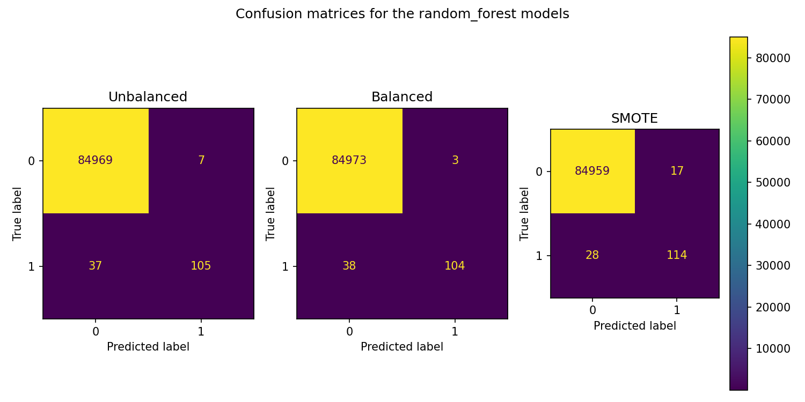

The confusion matrices reveal that:

- all the models have very low false alarms except the SMOTE model which has **17**. This does come at the cost, however, of more false negatives which is not ideal.

- the **SMOTE** model has the **least** number of **false negatives(28)** of the three models. It also has the highest number of true positives. This is what we want in the best random forest model.

- as suspected earlier, the models all have a higher number of false negatives compared to false positives (hence the higher precision compared to recall). A higher number of false positives in exchange for lower false negatives, as is the case in the **SMOTE** model, is tolerable since a missed event(false negative) is far more costly compared to a false alarm(false positive).

Let us finally have a look at the **PR-AUC curves** for the models.

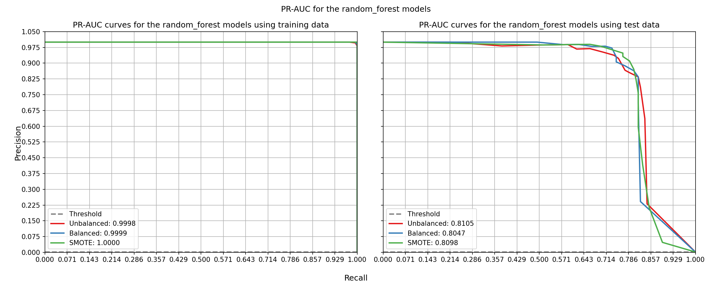

Looking at the **PR-AUC curves**:

- all the models perform well on both the train and test set with the unbalanced model edging the SMOTE model slightly on the test set.

- the models might be severely overfit as they all show significant perfomance drops of almost **20%** from when using training data to when using testing data.

All the models perform similarly well at predicting the positive class with as few false alarms as possible. However, the SMOTE model does the best, at the default decision threshold of 0.5, of predicting most of the fraudulent events as evidenced by the confusion matrices plot. This,combined with its good PR-AUC score, make it the best candidate for **best random forest model**.

#### v) Conclusion

The **best random forest model** (for our purposes) is the **SMOTE** model.

<h3 id='decision-tree' align='center'>
d) Decision Tree
</h3>

_Click [here](#table-of-contents) to go back to the table of contents._

#### i) Unbalanced

|              | precision |   recall | f1-score | support |
| :----------- | --------: | -------: | -------: | ------: |
| 0            |  0.999576 | 0.999753 | 0.999665 |   84976 |
| 1            |  0.834646 | 0.746479 | 0.788104 |     142 |
| accuracy     |   0.99933 |  0.99933 |  0.99933 | 0.99933 |
| macro avg    |  0.917111 | 0.873116 | 0.893884 |   85118 |
| weighted avg |  0.999301 |  0.99933 | 0.999312 |   85118 |

#### ii) Balanced

|              | precision |   recall | f1-score |  support |
| :----------- | --------: | -------: | -------: | -------: |
| 0            |  0.999652 | 0.979594 | 0.989521 |    84976 |
| 1            | 0.0611803 | 0.795775 | 0.113625 |      142 |
| accuracy     |  0.979288 | 0.979288 | 0.979288 | 0.979288 |
| macro avg    |  0.530416 | 0.887684 | 0.551573 |    85118 |
| weighted avg |  0.998086 | 0.979288 |  0.98806 |    85118 |

#### iii) SMOTE

|              | precision |   recall |  f1-score |  support |
| :----------- | --------: | -------: | --------: | -------: |
| 0            |  0.999681 | 0.959389 |  0.979121 |    84976 |
| 1            | 0.0325203 | 0.816901 | 0.0625506 |      142 |
| accuracy     |  0.959151 | 0.959151 |  0.959151 | 0.959151 |
| macro avg    |  0.516101 | 0.888145 |  0.520836 |    85118 |
| weighted avg |  0.998068 | 0.959151 |  0.977591 |    85118 |

#### iv) Evaluation

The classification reports reveal that:

- all the models perform well on the negative class with the unbalanced model performing the best. This is to be expected as the unbalanced model does nothing to try to make sure it predicts the positive class well and is instead heavily biased towards predicting the negative class well.

- the **unbalanced** model has the **highest precision** but the **lowest recall** on the positive class.

- the **SMOTE** model has the **highest recall** but the **lowest precision** on the positive class.

Since we are prioritizing recall, the **SMOTE** model is showing the best performance of the three.

Let us take a look at the confusion matrices for the decision trees:

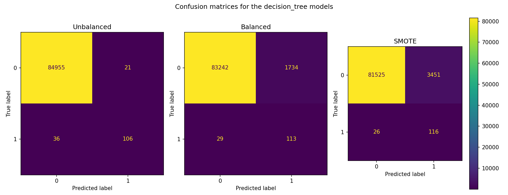

The confusion matrices reveal that:

- the **unbalanced model** has the **fewest false positives** of the three models; hence the high precision score it had. It, however, has the **highest number of false negatives** hence why it has the **lowest recall score**.

- the **SMOTE** model has the **highest number of false positives (3451)** with the **lowest number of false negatives (26)**

We are prioritizing capturing as many of the fraudulent cases as possible even at the cost of high false alarms. The **SMOTE model** looks like the best model to go with thus far.

Let us look at the **PR-AUC** curves for the models:

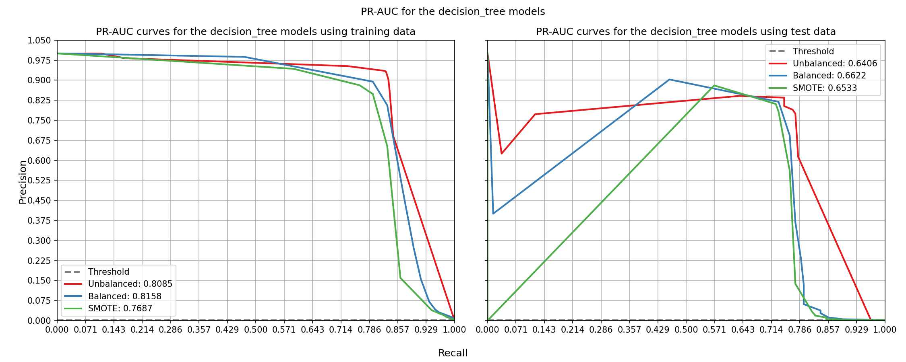

The PR-AUC curves reveal that:

- the **balanced model** is the best model of the three (using either training or testing data) at predicting the positive class with **as few false alarms** as possible with a PR-AUC score of **0.8158** on the training data and a score of **0.6622** on the test data.

- the **SMOTE model**, previously our best model, performs the worst on the training data with a score of **0.7687** and second-worst on the test data with a score of **0.6622**

However, since we are prioritizing minimizing false negatives (missed events) over false positives (false alarms), the **SMOTE model** is still the best model.

#### v) Conclusion

The **SMOTE decision tree model** is the **best decision tree model**.

<h3 id='neural-network' align='center'>
e) Neural Network
</h3>

_Click [here](#table-of-contents) to go back to the table of contents._

#### i) Unbalanced

|              | precision |   recall | f1-score |  support |
| :----------- | --------: | -------: | -------: | -------: |
| 0            |  0.999647 |   0.9998 | 0.999723 |    84976 |
| 1            |  0.868217 | 0.788732 | 0.826568 |      142 |
| accuracy     |  0.999448 | 0.999448 | 0.999448 | 0.999448 |
| macro avg    |  0.933932 | 0.894266 | 0.913146 |    85118 |
| weighted avg |  0.999428 | 0.999448 | 0.999435 |    85118 |

#### ii) Balanced

|              | precision |   recall | f1-score |  support |
| :----------- | --------: | -------: | -------: | -------: |
| 0            |  0.999751 | 0.993363 | 0.996547 |    84976 |
| 1            |  0.176642 | 0.852113 | 0.292624 |      142 |
| accuracy     |  0.993127 | 0.993127 | 0.993127 | 0.993127 |
| macro avg    |  0.588197 | 0.922738 | 0.644585 |    85118 |
| weighted avg |  0.998378 | 0.993127 | 0.995372 |    85118 |

#### iii) SMOTE

|              | precision |   recall | f1-score |  support |
| :----------- | --------: | -------: | -------: | -------: |
| 0            |  0.999647 | 0.998929 | 0.999288 |    84976 |
| 1            |  0.551724 | 0.788732 | 0.649275 |      142 |
| accuracy     |  0.998578 | 0.998578 | 0.998578 | 0.998578 |
| macro avg    |  0.775685 | 0.893831 | 0.824282 |    85118 |
| weighted avg |  0.998899 | 0.998578 | 0.998704 |    85118 |

#### iv) Evaluation

The classification reports reveal the following:

- all of the models perform well on the negative class.

- the **balanced model** has the **highest recall** of **0.8521** and the **lowest precision** of **0.1766** as well as the **lowest f1 score** of **0.2926** on the positive class.

- the **unbalanced model** has the **highest precision** score of **0.8682**, the **highest f1 score** of **0.8266** and **similar recall to the SMOTE model** of **0.7887** on the positive class.

These observations reveal that:

- the unbalanced model records the lowest number of false alarms while capturing a decent amount of the fraudulent events as evidenced by its decent recall.

- the balanced model does the best at capturing the fraudulent events. However, it has an abysmally relatively high number of false alarms. The balanced model is more prone to over-predicting positives.

- the SMOTE model has decent recall but relatively low precision which reveal that it captures a decent amount of the fraudulent events (similar number to the unbalanced model) but with a relatively high number of false alarms (not as high as the balanced model's though).

Let us take a look at the confusion matrices of the models:


The confusion matrices reveal that:

- our previous conclusions were correct: the **balanced model** has the **lowest number of false negatives (21)** which means it is the best at capturing fraudulent events. It also has the highest number of false positives, hence its very low precision score.

- the **unbalanced and SMOTE models** have a similar number of **false negatives and true positives** hence the similar recall they had. The SMOTE model, however, has a higher number of false positives hence its lower precision score compared to the unbalanced model.

Let us now look at the **PR-AUC curves** for the models:

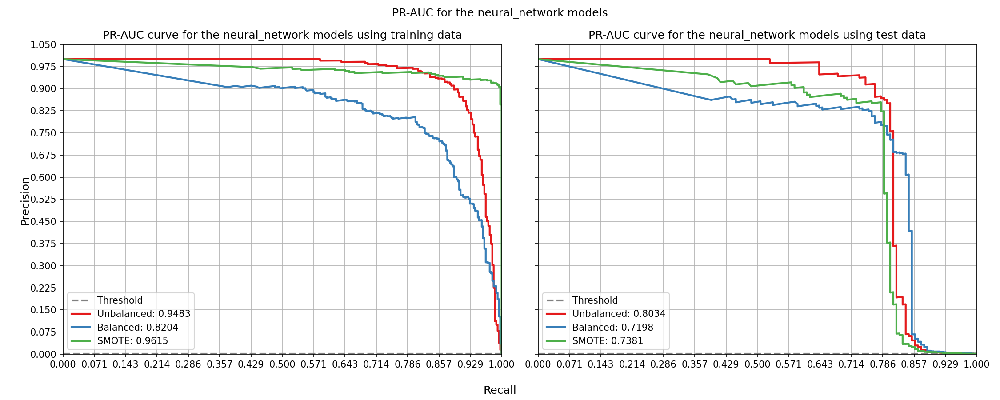

The PR-AUC curves reveal that:

- the **unbalanced model** has the **second highest average precision score** on the **training data** of **0.9483** just behind **SMOTE's**. It also has the **highest average precision score** on the **test data** of **0.8034**. This is a performance drop of around **14%**: not too bad especially when compared with some of the other models.

- the **SMOTE model** has the **highest average precision score** on the **training data** of **0.9615** and the **second highest average precision score** on the **test set** of **0.7381**; a performance drop of around **23%**. This is an indication that the **SMOTE** model might be overfit.

- the **balanced model** has the **worst average precision score** of the three across **both the training and test set** of **0.8204** and **0.7198** respectively. This is a performance drop of around **11%**: the lowest of the three.

#### v) Conclusion

Ultimately, given what the **PR-AUC curves** represent, that is, the ability of the model to predict positives well without raising many false alarms, the poor performance demonstrated by the **balanced model** does not lower its overall ranking in what we should go with as the **best neural network model**.

This is because, as stated previously, we are very much willing to tolerate more false alarms if it means more of the fraudulent events will be captured.

Thus, given this and the fact that the balanced model performs the best (in terms of recall) at the default decision threshold of **0.5** as evidenced by the confusion matrices, the **balanced neural network model** is selected as the **best neural network model** for our purposes.

<h2 id='model-evaluation' align='center'>
4. Model Evaluation
</h2>

_Click [here](#table-of-contents) to go back to the table of contents._
