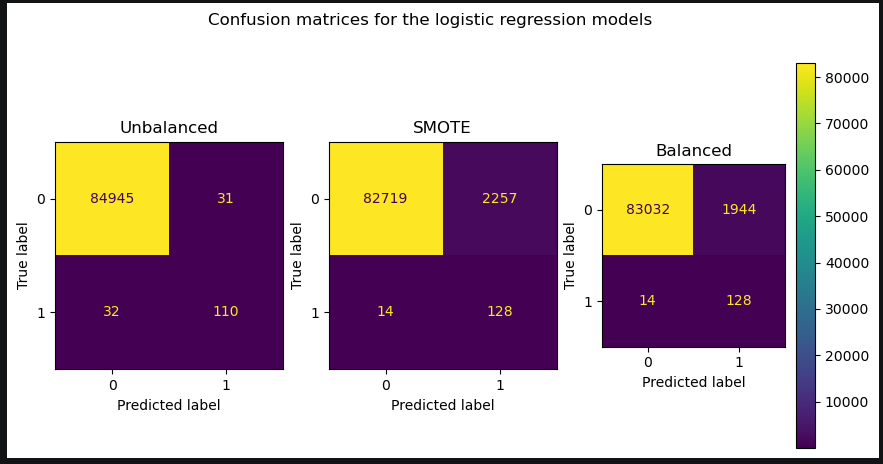
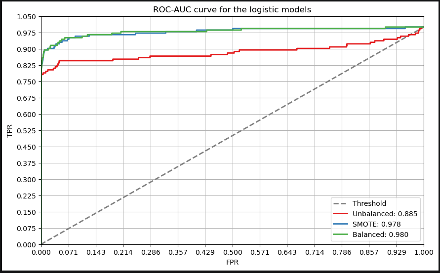
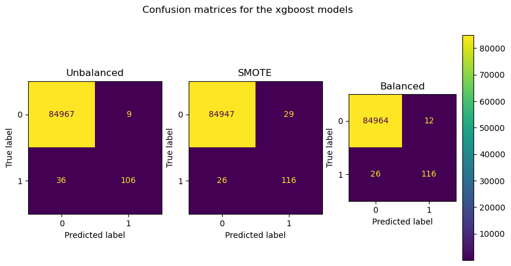
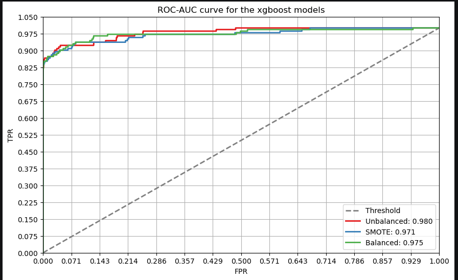
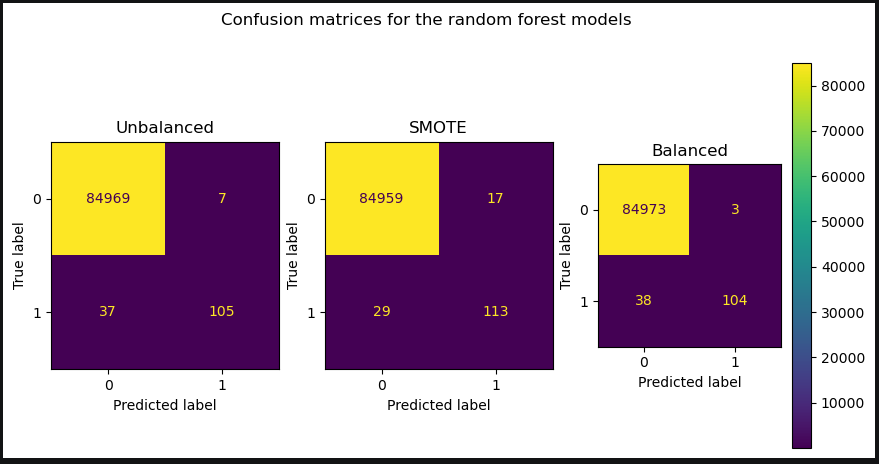
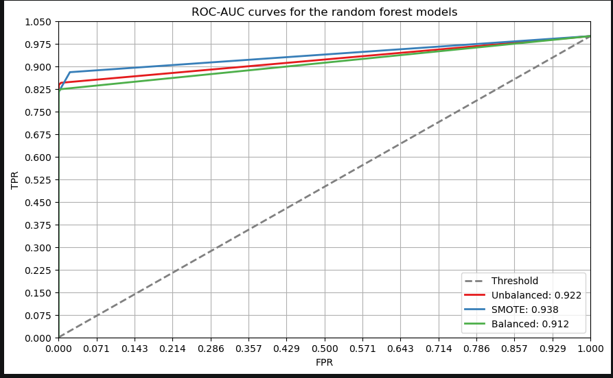

<h1 align='center'>
<u>KAGGLE CREDIT CARD FRAUD DETECTION</u>
</h1>


## Declaration

> **Author**: This project was independently conceived, developed, and completed by Ngundo Muithya. All code, analysis, and documentation herein represent my own original work.

## Overview

Credit card fraud is a significant and growing threat to the financial industry, both globally and in Kenya. According to the [Central Bank of Kenya's Financial Sector Stability Report](https://businessfront.com/finance/insights/fraud-costs-hit-11m-kenyan-banks/), card fraud losses at Kenyan banks surged more than 16-fold in a single year, from **KSh 15.5 million** to **KSh 263.3 million**, even as the number of reported incidents rose only marginally. This shows that individual fraud cases are becoming far more costly, not just more frequent, underscoring the need for effective detection systems.

Fraudulent transactions also represent a small fraction of all transactions, resulting in highly imbalanced datasets that make detection a challenging machine learning problem. This project builds a classification pipeline to detect fraudulent credit card transactions, addressing this imbalance through techniques such as SMOTE and tuned ensemble models.

The dataset used ([here](./Data/creditcard.csv)) comes from [Kaggle](https://www.kaggle.com/datasets/mlg-ulb/creditcardfraud) and contains transactions made by European cardholders in Spetember 2013.

Five model families were evaluated:

a) **Logistic Regression**

b) **XGBoost**

c) **Random Forest**

d) **Decision Tree**

e) **Neural Network**

to find the best model for the problem. Class imbalance is handled throughout the modelling approach.

## Instructions to clone

Ensure, after cloning the repository, to run the following command in the terminal while in the project folder:

```bash
git lfs pull
```

This downloads the credit card data into your local machine.

<h2 align='center'>
1. Data Understanding
</h2>

The dataset used ([here](./Data/creditcard.csv)) comes from [Kaggle](https://www.kaggle.com/datasets/mlg-ulb/creditcardfraud) and contains transactions made by European cardholders in Spetember 2013.

The dataset is highly imbalanced with the positive class (frauds) accounting for only **0.172%** of the transactions.

Features **V1, V2,..., V28** are the principal components obtained with PCA. The only features which have not been transformed with PCA are **Time** and **Amount**.

**Time** contains the **seconds** elapsed between each transaction and the first transaction in the dataset.

**Amount** is the transaction amount, this feature can be used for example-dependant cost-sensitive learning. (The currency was not provided by Kaggle)

**Class** is the response variable and it takes value 1 in case of fraud and 0 otherwise.

<h2 align='center'>
2. Data Visualisation
</h2>

### a) Class Imbalance


Using a logarithmic scale for the y-axis makes the sheer class imbalance the dataset suffers from clear, with the negative class(0) making up **~99%** of the dataset.

### b) Amount Distribution


Most of the transaction amounts tend to cluster around the mean of **88** with higher amounts, such as 25,000 being very rare.


On average, fraudulent transactions tend to be of higher amounts than genuine ones. This is to be expected, as the requests from criminals will almost always be for large sums of money.

### c) Time Distribution


This plot shows peaks at whole number values for the gap between transactions. This is because the time values in provided in the dataset were all integers, so their gaps would also be integers and the probability of finding decimal gaps is effectively 0.

The most frequent gap was **0 seconds**.

> **NB**: This is not to mean that the transactions occurred at the same time. It just suggests that the level of granularity chosen to record the time (seconds) was not enough to show a clear separation between transactions. If the transaction times were recorded in milliseconds, for example, they might show that the transactions occurred at different times.

Larger gaps become less and less infrequent. Those larger gaps indicate periods when transaction traffic was low. This could be for any number of reasons e.g. it could have been at night when people were asleep or the system(s) experienced some form of downtime.


Fraudulent transactions tend to occur when transactions are happening **infrequently** i.e. the gap between transactions is high compared to genuine transactions. This could be due to any number of reasons.

<h2 align='center'>
3. Model Building
</h2>

Five model families were built:

a) **Logistic Regression** - This will be our baseline model. We will compare all the other models to this baseline.

b) **XGBoost** - This tree ensemble might prove effective at predicting.

c) **Random Forest** - Another tree ensemble

d) **Decision Tree** - A single decision tree

e) **Neural Network** - A collection of artificial neurons connected by weighted edges

**Recall** was prioritised as false negatives (false alarms) are costly and should be minimized.

Two strategies were employed to deal with the class imbalance present in the dataset: **SMOTE** and **Using balanced class weight** with the best model using either of the two strategies being selected for the final evaluation to be done across the model families.

Here are the results:

<h3 align='center'>
a) Logistic Regression
</h3>

#### i) Unbalanced

|              | precision |   recall | f1-score | support |
| :----------- | --------: | -------: | -------: | ------: |
| 0            |  0.999623 | 0.999635 | 0.999629 |   84976 |
| 1            |  0.780142 | 0.774648 | 0.777385 |     142 |
| macro avg    |  0.889883 | 0.887142 | 0.888507 |   85118 |
| weighted avg |  0.999257 |  0.99926 | 0.999259 |   85118 |

accuracy: 0.99926

#### ii) SMOTE

|              | precision |   recall | f1-score | support |
| :----------- | --------: | -------: | -------: | ------: |
| 0            |  0.999831 |  0.97344 | 0.986459 |   84976 |
| 1            | 0.0536688 | 0.901408 | 0.101306 |     142 |
| macro avg    |   0.52675 | 0.937424 | 0.543882 |   85118 |
| weighted avg |  0.998252 | 0.973319 | 0.984982 |   85118 |

accuracy: 0.973319

#### iii) Balanced

|              | precision |   recall | f1-score | support |
| :----------- | --------: | -------: | -------: | ------: |
| 0            |  0.999831 | 0.977123 | 0.988347 |   84976 |
| 1            | 0.0617761 | 0.901408 | 0.115628 |     142 |
| macro avg    |  0.530804 | 0.939266 | 0.551987 |   85118 |
| weighted avg |  0.998266 | 0.976997 | 0.986891 |   85118 |

accuracy: 0.976997

#### iv) Evaluation

All of the models are very good at predicting genuine transactions, with extremely high precision, recall and f1-scores on the negative class (0).

However, the balanced and SMOTE models show poor precision scores on the positive class (which contributes to their poor f1-score as well) despite having very high recall on the same class. As stated earlier, this is a sign that the models have a high number of **false positives**. In the context of our application, this means the models flag a high number of genuine transactions as fraudulent.

The models having a higher recall, however, than the unbalanced model means they capture more of the fraudulent events at the expense of more false alarms.

This is something we are willing to tolerate as a false alarm is more manageable compared to a missed event.



The unbalanced logistic model had a higher number of **false negatives** (missed events), hence low recall, compared to the SMOTE and balanced models. This is the metric we care about! A good model should be able to detect as many of the positive events as possible; that means have as **few false negatives** as possible.

The balanced model had fewer false positives (false alarms) compared to the SMOTE model while having the same number of true positives and false negatives. In other words, even though the SMOTE model had a higher number of false alarms, this did not translate to more captured events (true positives) when compared to the balanced model.

#### v) Conclusion

The balanced model is the **best** logistic model as it captures the **most fraudulent events** with as **few false alarms** as possible.



The **balanced** model has the highest **AUC** score of **0.98** further reinforcing our conclusion.

<h3 align='center'>
b) XGBoost
</h3>

#### i) Unbalanced

|              | precision |   recall | f1-score | support |
| :----------- | --------: | -------: | -------: | ------: |
| 0            |  0.999576 | 0.999894 | 0.999735 |   84976 |
| 1            |  0.921739 | 0.746479 | 0.824903 |     142 |
| macro avg    |  0.960658 | 0.873186 | 0.912319 |   85118 |
| weighted avg |  0.999447 | 0.999471 | 0.999444 |   85118 |

accuracy: 0.999471

#### ii) SMOTE

|              | precision |   recall | f1-score | support |
| :----------- | --------: | -------: | -------: | ------: |
| 0            |  0.999694 | 0.999659 | 0.999676 |   84976 |
| 1            |       0.8 | 0.816901 | 0.808362 |     142 |
| macro avg    |  0.899847 |  0.90828 | 0.904019 |   85118 |
| weighted avg |  0.999361 | 0.999354 | 0.999357 |   85118 |

accuracy: 0.999354

#### iii) Balanced

|              | precision |   recall | f1-score | support |
| :----------- | --------: | -------: | -------: | ------: |
| 0            |  0.999694 | 0.999859 | 0.999776 |   84976 |
| 1            |   0.90625 | 0.816901 | 0.859259 |     142 |
| macro avg    |  0.952972 |  0.90838 | 0.929518 |   85118 |
| weighted avg |  0.999538 | 0.999554 | 0.999542 |   85118 |

accuracy: 0.999554

#### iv) Evaluation

All the models perform well on the negative class.

The unbalanced model has high precision (**0.9217**) but relatively low recall (**0.7465**) on the positive class. This might mean that it has a relatively low number of false positives (false alarms). It, however, has a relatively high number of false negatives (missed events) as evidenced by its relatively low recall on the positive class. This makes it a bad candidate for the best overall model.

The SMOTE model has a lower precision score (**0.8**) but a higher recall (**0.8169**) on the positive class. This means it has a higher number of false positives but a lower number of false negatives. This makes it a better model for our purposes.

The balanced model has a higher precision than the SMOTE model (**0.9062**) with a similar recall (**0.8169**) on the positive class. This means it has the same number of false negatives as the SMOTE model but fewer false alarms. This makes the **balanced model** the best of the three.



We can see that, as said earlier, the unbalanced model has a low number of false positives but a high number of false negatives. Since missed events (false negatives) are more costly than false alarms, the unbalanced model is **NOT** the model to go with.

As we saw earlier, the balanced model has the same number of false negatives as the SMOTE model with fewer false positives (**12** vs **29**). It offers similar capability of catching fraudulent events as the SMOTE model but with less false alarms.

#### v) Conclusion

The confusion matrices confirm that the **balanced model** is the best model for our purposes.



The unbalanced model has the highest auc score of the three (**0.980**). This means it is the best at correctly classifying the genuine events **across different decision thresholds**.

In a close second is the balanced model (**0.975**), which had the second-lowest number of false positives.

Third is the SMOTE model (**0.971**) which had the most false positives.

Since we aim to use the default decision threshold of 0.5, the **balanced model** is still the best model as it minimizes the number of false negatives with minimal false positives (and has a decent AUC score) at the default decision threshold.

<h3 align='center'>
c) Random Forest
</h3>

#### i) Unbalanced

|              | precision |   recall | f1-score | support |
| :----------- | --------: | -------: | -------: | ------: |
| 0            |  0.999565 | 0.999918 | 0.999741 |   84976 |
| 1            |    0.9375 | 0.739437 | 0.826772 |     142 |
| macro avg    |  0.968532 | 0.869677 | 0.913256 |   85118 |
| weighted avg |  0.999461 | 0.999483 | 0.999453 |   85118 |

accuracy: 0.999483

#### ii) SMOTE

|              | precision |   recall | f1-score | support |
| :----------- | --------: | -------: | -------: | ------: |
| 0            |  0.999659 |   0.9998 | 0.999729 |   84976 |
| 1            |  0.869231 | 0.795775 | 0.830882 |     142 |
| macro avg    |  0.934445 | 0.897787 | 0.915306 |   85118 |
| weighted avg |  0.999441 |  0.99946 | 0.999448 |   85118 |

accuracy: 0.99946

#### iii) Balanced

|              | precision |   recall | f1-score | support |
| :----------- | --------: | -------: | -------: | ------: |
| 0            |  0.999553 | 0.999965 | 0.999759 |   84976 |
| 1            |  0.971963 | 0.732394 | 0.835341 |     142 |
| macro avg    |  0.985758 |  0.86618 |  0.91755 |   85118 |
| weighted avg |  0.999507 | 0.999518 | 0.999485 |   85118 |

accuracy: 0.999518

#### iv) Evaluation

The classification reports reveal that:

- all the models perform well on the negative(0) class (as expected).

- the model with the highest recall on the positive class is the **SMOTE** model with a recall of **0.7958** followed by the unbalanced model (0.7394) and then the balanced model (0.7324)

- all the models have lower recall compared to precision with the smallest gap between recall and precision belonging to the **SMOTE** model. This could be an indication that the models are more susceptible to false negatives(missed events) than false positives(false alarms) with the **SMOTE** model being the least susceptible.

All of these observations point to the **SMOTE** model as being the **best random forest model**.



The confusion matrix reveals that:

- the **SMOTE** model has the **least** number of **false negatives** of the three models. It also has the highest number of true positives. This is what we want in the best random forest model.

- as suspected earlier, the models all have a higher number of false negatives compared to false positives with the **SMOTE** model having the lowest difference. A higher number of false positives in exchange for lower false negatives, as is the case in the **SMOTE** model, is tolerable since a missed event(false negative) is far more costly compared to a false alarm(false positive)

#### v) Conclusion

Looking at the ROC-AUC curves:



The **SMOTE** model, represented by the blue line, has the largest AUC score of **0.938**. This means it is the best of the three models at correctly predicting instances of the positive class across various decision thresholds.

The best random forest model is thus the **SMOTE** model.

<h3 align='center'>
d) Decision Tree
</h3>
